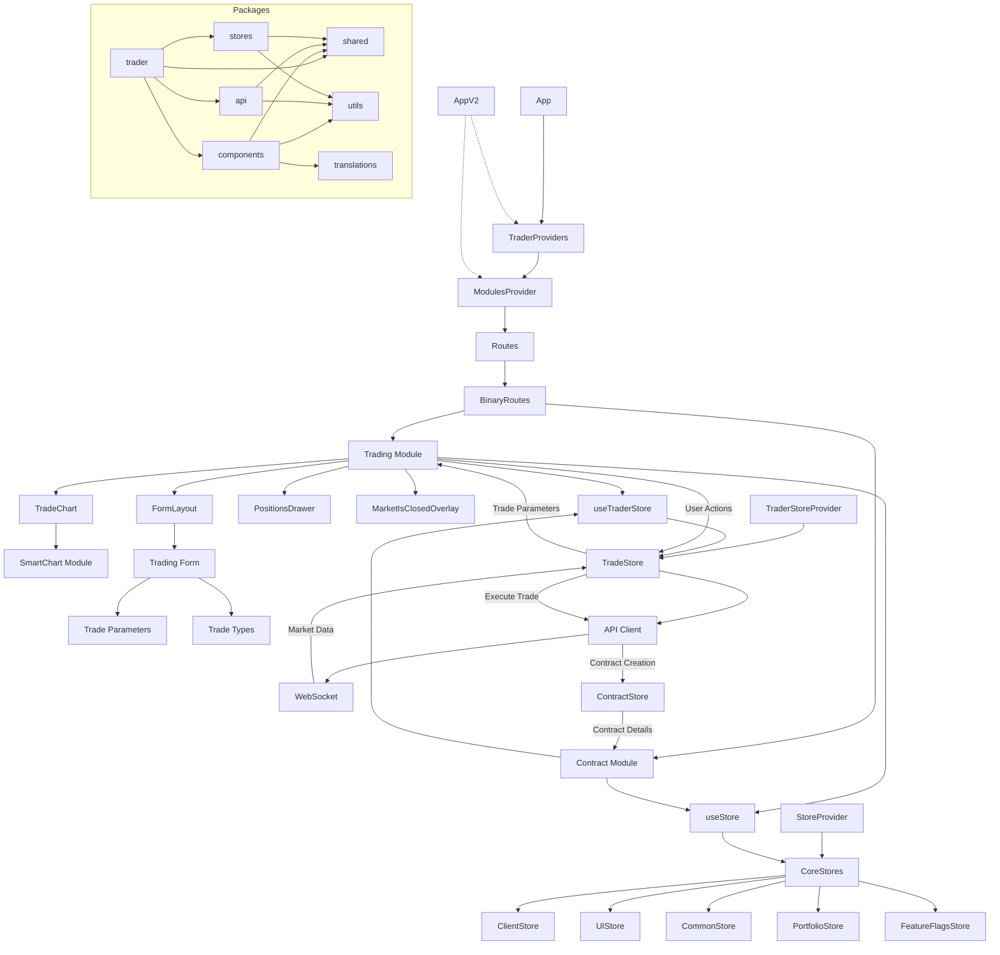
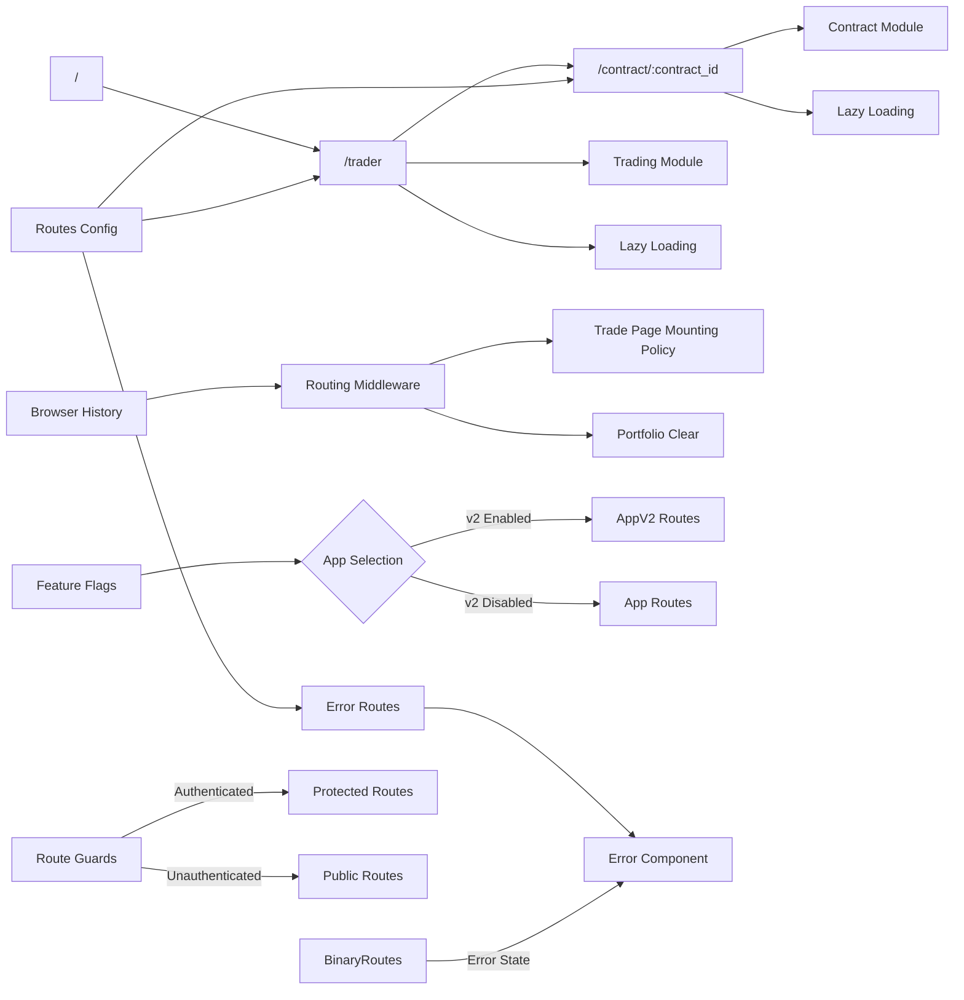

# Derivatives Trader Architecture Analysis

This document contains the architecture analysis for the Derivatives Trader application.

## Architecture Overview

The derivatives trader application is a React-based front-end project implemented using TypeScript. It employs a monorepo structure with multiple packages that separate concerns and functionalities. The application follows a modular approach to organization, with clear boundaries between different parts of the system.

### Key Architectural Patterns

- **Monorepo Structure**: The project uses a monorepo approach managed with npm workspaces, allowing for shared code while maintaining separation of concerns. Each package has its own build configuration and dependencies.
- **Component-Based Architecture**: UI is built using reusable React components that follow a hierarchical structure. Components are organized into feature-specific and shared components.
- **Context API + MobX**: State management combines React Context for providing store access and MobX for observable state. This provides a reactive programming model while maintaining good component isolation.
- **Code Splitting**: The application implements dynamic imports and React.lazy for route-based code splitting. This improves initial load time by only loading necessary code.
- **Feature-Based Organization**: Modules are organized by business functionality rather than technical layers, improving cohesion and reducing coupling.
- **Progressive Enhancement**: The app implements both legacy (App) and next-gen (AppV2) versions, suggesting an incremental migration strategy.
- **Responsive Design Architecture**: The application implements different layouts and behaviors for mobile, tablet, and desktop viewports, with device detection logic.
- **Feature Flags**: The application uses feature flags to enable/disable features and control which version of components to use (App vs AppV2).

### Package Organization

The codebase is organized into multiple packages:

- **api/api-v2**: API client libraries for communicating with backend services, with v2 likely representing an improved implementation
- **components**: Reusable UI components library with a comprehensive set of common UI elements
- **trader**: Main trading application implementing the core business functionality
- **stores**: Central state management with observable stores
- **shared**: Common utilities, constants, and helpers shared across packages
- **translations**: Internationalization support using i18n
- **utils**: Utility functions for common operations
- **hooks**: Custom React hooks shared across the application
- **reports**: Reporting and analysis functionality
- **core**: Core business logic and domain models

### Module Structure

The main trader package is organized into modules:

- **Trading**: Core trading functionality including trade parameters, chart integration, and execution
- **Contract**: Contract details and management for viewing and managing active positions
- **SmartChart**: Chart visualization components for technical analysis
- **App/AppV2**: Main application shells with different implementations

### Inter-Package Dependencies

The packages have clear dependency relationships:

- **trader** → depends on components, stores, shared, api
- **components** → depends on shared, utils, translations
- **api/api-v2** → depends on shared, utils
- **stores** → depends on shared, utils
- **All packages** → may depend on types (global type definitions)

### State Management

The application uses a sophisticated state management approach:

- Root stores are provided via StoreProvider from @deriv/stores
- Module-specific stores are provided via ModulesProvider
- Custom hooks (useStore, useTraderStore) enable components to access relevant state
- Stores are structured hierarchically with specialized stores for different domains
- Store initialization happens at the App level with dependency injection for services
- Unmounting lifecycle hooks ensure proper cleanup of resources
- MobX provides reactivity through observables, computed values, and actions

## Key Modules

### TraderModule

- **Dependencies**: TradeStore, UIStore, ClientStore, SmartChartModule
- **Description**: Main trading interface providing trade type selection, parameter configuration and submission. Responsible for market selection, trade type selection, parameter configuration, and trade execution. Integrates with SmartChart for visualizations and form components for trade parameters. Handles different trading modes (accumulators, turbos, vanilla options) with specialized UI. Implements responsive behavior for different device types and orientations.

### SmartChartModule

- **Dependencies**: ChartStore, MarketStore
- **Description**: Chart visualization and technical analysis tools. Provides interactive price charts with various timeframes, indicators, and drawing tools. Consumes market data and provides visual representation for decision making. Supports different chart types and layouts with customization options. Implements touch interactions for mobile devices and mouse interactions for desktop.

### ContractModule

- **Dependencies**: ContractStore, PortfolioStore
- **Description**: Contract details and management after purchase. Displays contract specifications, current status, and potential outcomes. Allows tracking of active contracts and viewing historical performance. Provides real-time updates on contract status and profit/loss calculations. Manages contract lifecycle from purchase to expiry or early termination.

### AuthModule

- **Dependencies**: ClientStore, UIStore
- **Description**: User authentication and session management. Handles login, registration, account switching, and session persistence. Manages user profile information and authentication state. Controls access to features based on user authentication status. Implements secure token storage and refresh mechanisms.

### StoreModule

- **Dependencies**: APIClient, LocalStorage
- **Description**: Central state management using MobX with React Context integration. Provides reactive state with observables and computed values. Implements hierarchy of specialized stores with core stores and module-specific stores. Handles persistence of state between sessions where needed. Manages unmounting lifecycle to prevent memory leaks. Coordinates state synchronization between different parts of the application.

### APIModule

- **Dependencies**: WebSocket, RESTClient
- **Description**: Communication layer with backend services using WebSocket and REST. Manages real-time data streams for market prices and notifications. Handles authentication, request formatting, error handling, and response parsing. Available in two versions (api and api-v2) suggesting an evolution of the API interface. Implements reconnection logic and connection status monitoring. Provides typed interfaces for API requests and responses.

### ResponsiveModule

- **Dependencies**: UIStore, DeviceDetection
- **Description**: Responsive design implementation for different device types. Provides device-specific components and layouts based on screen size. Implements swipeable interfaces for mobile and touch devices. Handles orientation changes and viewport adjustments. Uses media queries and JavaScript-based detection for optimal experiences.

### PositionsModule

- **Dependencies**: PortfolioStore, ContractStore
- **Description**: Manages open positions and trading history. Displays current open trades and their status. Provides filtering and sorting of positions. Shows real-time updates of position values. Integrates with the drawer component for responsive display.

## Dependency Graph

## Routing Flow

## Data Flow

1. **API Layer**: WebSocket and REST communication with backend services
2. **Store Layer**: State management using MobX stores
3. **Component Layer**: React components consuming store data
4. **User Interactions**: Actions captured by components
5. **Action Handlers**: Component callbacks or direct store method calls
6. **Store Updates**: State modifications through MobX actions
7. **API Requests**: Data persistence through API calls
8. **UI Updates**: Reactive rendering based on store changes

This unidirectional data flow ensures predictable state management and component rendering. The store layer acts as the central source of truth, with the API layer handling external communication. Components are primarily concerned with rendering state and capturing user interactions.

## Performance Optimization Patterns

The application employs several performance optimization strategies:

- **Lazy Loading**: Components are loaded on-demand using React.lazy and Loadable
- **Code Splitting**: Webpack chunk splitting for route-based code loading
- **Conditional Rendering**: Complex UI elements are only rendered when needed
- **Feature Flags**: Feature toggles control which code paths are active
- **WebSocket Management**: Real-time data connections are managed efficiently
- **Responsive Adjustments**: Different component implementations for mobile vs desktop
- **Memoization**: Strategic use of useMemo and React.memo for performance-critical components
- **Virtual Rendering**: For large lists of data (like positions or market selection)

## Error Handling Approach

The application implements multi-layered error handling:

- **Error Boundaries**: React error boundaries catch rendering errors
- **Network Error Handling**: Dedicated components for network status issues
- **API Error Processing**: Structured approach to API error responses
- **UI Error Feedback**: Error modal and notification system for user feedback
- **Error Routing**: Dedicated error routes for application-level errors
- **Fallback Components**: Loading states and error states for async operations

## Build System

The application uses a sophisticated build system to support the monorepo structure:

- **npm workspaces**: Manages the monorepo packages and their interdependencies
- **Webpack**: Handles code bundling, splitting, and optimization
- **Babel**: Transpiles modern JavaScript features for browser compatibility
- **TypeScript**: Provides static typing and compile-time checks
- **Jest**: Testing framework configuration for unit and integration tests
- **PostCSS**: Processes CSS with plugins like autoprefixer
- **ESLint**: Static code analysis for code quality
- **Prettier**: Code formatting enforcement

The build process includes optimizations for production builds, development mode with hot reloading, and specialized builds for different environments. Code splitting is implemented through webpack chunking, enabling efficient loading of application parts. The system also includes custom ESLint rules for project-specific code quality enforcement.

## Testing Architecture

The testing architecture supports multiple testing levels:

- **Unit Tests**: Component and utility function tests in **tests** directories
- **Integration Tests**: Store and service interaction tests
- **Mock System**: Custom mock implementations for external dependencies
- **Test Utilities**: Shared testing helpers and fixtures

The code structure supports testability through:

- Dependency injection for services and stores
- Component isolation with clear props interfaces
- Mock implementations of external services
- Test configuration for different packages

Test files are typically co-located with the code they test, following a "**tests**" directory pattern or "[filename].test.ts" naming convention. The testing approach emphasizes isolation of components and services, with mock implementations for external dependencies. Jest is used as the primary testing framework, with React Testing Library for component testing.

## Styling Architecture

The application uses a mixed styling approach:

- **SCSS Modules**: Component-specific styling with scoped class names
- **Sass Variables**: Shared design tokens and theming values
- **Responsive Breakpoints**: Media query mixins for different device sizes
- **CSS-in-JS**: Some dynamic styling applied through inline styles
- **Themes**: Support for light and dark mode through theme variables

## Internationalization Approach

The application implements internationalization (i18n) through:

- Dedicated translations package with language resources
- Translation function (localize) for string externalization
- Language selection and persistence
- RTL (Right-to-Left) layout support for appropriate languages
- Number and date formatting based on locale
- Dynamic loading of language resources

This approach enables the application to support multiple languages while maintaining a single codebase. Translations are managed as external resources, allowing for updates without code changes.

## Accessibility Considerations

The application's accessibility implementation includes:

- ARIA attributes on interactive elements
- Keyboard navigation support
- Focus management
- Screen reader compatibility
- Sufficient color contrast
- Text resizing support

Areas for potential accessibility improvements include:

- More comprehensive keyboard navigation testing
- Enhanced screen reader announcements for dynamic content
- Implementing skip navigation links
- Better focus indicators for keyboard users
- More robust form error messaging for assistive technologies

## Security Considerations

The architecture includes several security-related aspects:

- Authentication state management through dedicated stores
- Session persistence and token management
- Feature access control based on user authentication status
- Client-side input validation before submission
- Global error handling to prevent exposing sensitive information
- Type checking to reduce injection vulnerabilities

Areas for potential security improvements include:

- More consistent validation patterns across form inputs
- Stronger typing for API responses to prevent unexpected data handling
- More comprehensive sanitization of user inputs
- Enhanced protection against cross-site scripting attacks
- Implementing Content Security Policy headers
- Strengthening protection against click-jacking and other common web vulnerabilities
- Adding more robust CSRF protection mechanisms
- Implementing stronger client-side storage encryption for sensitive data

## Global Types

- **TCoreStores**: Core application store types shared across modules, used for accessing global state
- **TWebSocket**: WebSocket client type used for API communication, ensuring consistent interface for real-time data
- **TRouteConfig**: Route configuration type for application navigation, defining the structure of routes
- **Apptypes**: Common application props type with store and API dependencies, used for component props
- **TickSpotData**: Type for market tick data used in both trading and charting components
- **TStores**: Aggregate store type combining core and feature stores
- **TBottomWidgetsParams**: Type for chart bottom widgets used across different chart implementations
- **TTradePageMountingMiddlewareParams**: Type for trade page mounting middleware parameters, used in routing logic
- **TMatchPattern**: Type for route matching patterns used in the routing middleware

## Code Smells

- Multiple version branches (App vs AppV2) suggesting complex migration in progress. This creates duplication and increases the maintenance burden. Consider a more strategic approach to migration with shared components.
- Inline timeouts and setTimeout usage directly in components rather than in dedicated services. For example, in the Trade component there are multiple setTimeout calls for managing UI state. This makes timing-related behavior difficult to test and maintain.
- Disabled ESLint rules in multiple places (particularly eslint-disable-next-line react-hooks/exhaustive-deps) indicating potential issues with dependency arrays in useEffect hooks. This suggests possible stale closure bugs or unnecessary re-renders.
- Complex conditional rendering with multiple nested conditions in the Trade component making the code difficult to follow and maintain. Consider breaking down complex conditionals into smaller, more focused components or helper functions.
- Mixing of state management approaches (MobX, Context API, and local component state) without clear boundaries for when each should be used. Establish clear guidelines for when to use each approach.
- Usage of any types in TypeScript, particularly in global types like window extensions, which reduces type safety benefits. Replace with more specific types where possible.
- Duplicate utility functions across packages that could be consolidated, leading to inconsistencies and maintenance challenges. Create a centralized utilities package with well-defined interfaces.
- Large React components with multiple responsibilities (like the Trade component) that could be broken down into smaller, more focused components. Apply the single responsibility principle more rigorously.
- Direct DOM manipulation in React components (using document.querySelector) instead of using refs, creating potential issues with the React rendering lifecycle. Replace with proper React patterns for DOM interaction.
- Memoization inconsistencies - some components use React.memo and useMemo while similar components don't, creating unpredictable performance characteristics. Establish clear guidelines for when and how to use memoization.
- Inconsistent error handling approaches across different parts of the application, making errors harder to debug and resolve. Create standardized error handling patterns.
- Lack of clear boundaries between presentation and business logic in some components, making them harder to test and maintain. Apply a more consistent separation of concerns.
- Inconsistent naming conventions for files and components across the codebase, making it harder to locate related code. Establish and enforce consistent naming standards.
- Commented-out code indicating abandoned implementation attempts or temporary solutions that were never properly resolved.

## Suggestions for Improvement

- Consider extracting chart-related components into a standalone package to improve modularity and reusability. Currently, SmartChart is tightly coupled with the trading module, making it difficult to use independently in other contexts.
- Implement stronger typing for store interfaces to reduce reliance on any types and improve type safety. Many global types use 'any' which undermines TypeScript's benefits and could lead to runtime errors that static typing should prevent.
- Standardize the pattern for React hooks across packages - some use React.useState while others use the hook directly. This inconsistency makes the codebase less predictable and harder to maintain. Establish coding standards for hook usage.
- Consolidate the dual implementation approach (App vs AppV2). The parallel implementations increase maintenance burden and could introduce inconsistencies. Consider a more incremental migration strategy with feature flags to toggle specific components rather than entire application versions.
- Implement more extensive memoization to prevent unnecessary re-renders, particularly in the Trade component which has many dependencies that could trigger re-renders. Use React.memo with custom comparison functions where appropriate.
- Refactor the complex conditions in the Trade component to improve readability and maintainability. Extract complex conditional logic into separate functions or custom hooks. Consider using the strategy pattern for different trading modes.
- Standardize error handling patterns across the application. Implement a consistent approach to API errors, validation errors, and UI feedback. Create reusable error handling utilities and components that can be shared across the application.
- Consider implementing a proper dependency injection system to make testing easier and reduce the reliance on the React Context API for service access. This would improve testability and make dependencies more explicit.
- Enhance the separation between UI components and business logic by moving more complex logic from components to dedicated services or hooks. This would improve the testability of business logic and make UI components more focused on presentation.
- Consider implementing a state machine pattern for complex UI flows, particularly in trading workflows with multiple steps and conditions. This would make state transitions more explicit and easier to reason about.
- Standardize the approach to responsive design across components. Some components use device detection hooks while others use CSS-based approaches. Establish clear guidelines for responsive implementation.
- Implement more comprehensive API error handling and retry mechanisms, particularly for WebSocket connections which are critical for real-time trading. Consider implementing circuit breakers for failing API endpoints.
- Introduce stronger boundaries between packages by formalizing the public API of each package. Restrict internal implementation details from being directly accessed by other packages.
- Consider implementing a design system package that encapsulates design tokens, theming, and base components to ensure visual consistency across the application.

## Conclusion

This architectural analysis provides a comprehensive overview of the Derivatives Trader application's structure, dependencies, and design patterns. The analysis identifies both strengths in the current architecture as well as opportunities for improvement.

The monorepo structure with clear package boundaries provides good separation of concerns, while the use of modern React patterns and MobX for state management creates a solid foundation for the application. The combination of component-based architecture and feature-based organization results in a maintainable codebase.

Key areas for improvement include consolidating the dual implementation approach (App vs AppV2), strengthening type safety, standardizing patterns for hooks and error handling, and improving component organization to reduce complexity in large components.
