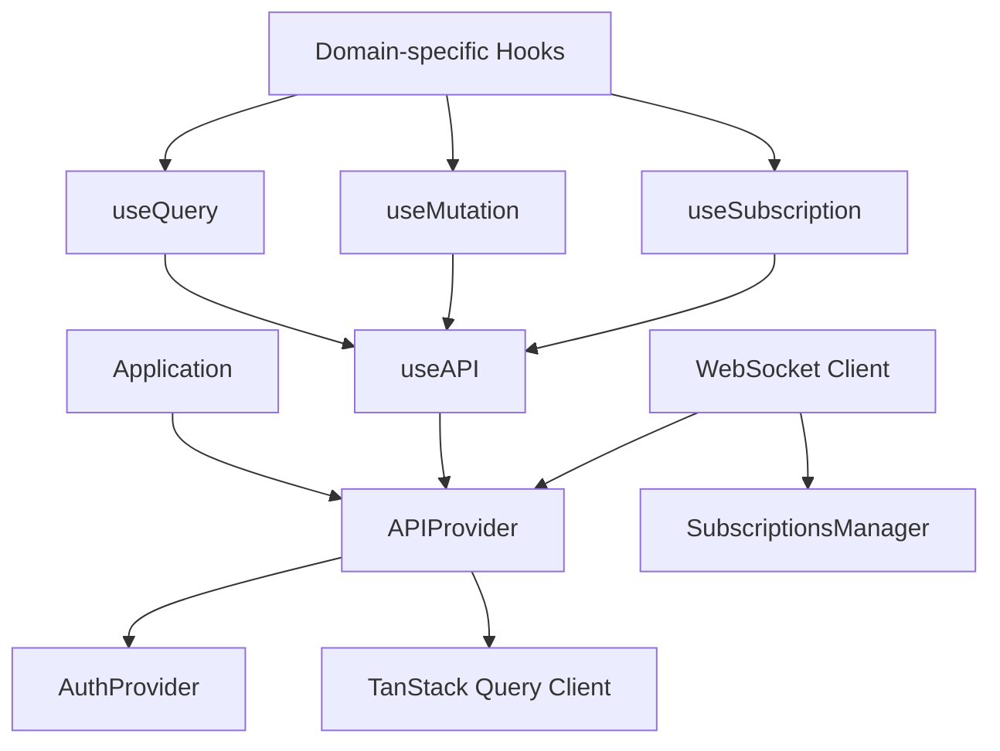

# @deriv/api-v2

A comprehensive WebSocket API client package for Deriv applications.

## Architecture Overview

The `@deriv/api-v2` package provides a React-based WebSocket API client for Deriv applications. It leverages React Context API, TanStack Query (React Query), and custom React hooks to facilitate efficient data fetching, state management, and real-time communication with Deriv's WebSocket API.

## Key Features

- WebSocket connection management with auto-reconnection
- React Query integration for request caching and state management
- Subscription-based real-time data updates
- Type-safe API requests and responses
- Authentication and authorization handling
- Comprehensive domain-specific hooks for common API operations

## Architectural Components

### Core Structure

```
api-v2/
├── src/
│   ├── APIProvider.tsx        # Main API context provider
│   ├── AuthProvider.tsx       # Authentication context provider
│   ├── useAPI.ts              # Hook for API access
│   ├── useQuery.ts            # Data fetching hook
│   ├── useMutation.ts         # Data mutation hook
│   ├── useSubscription.ts     # WebSocket subscription hook
│   ├── hooks/                 # Domain-specific API hooks
│   ├── constants/             # API-related constants
│   ├── types/                 # TypeScript type definitions
│   ├── utils/                 # Utility functions
│   └── ws-client/             # WebSocket client implementation
└── types.ts                   # Global type definitions
```

### Dependencies



## WebSocket Communication

The package establishes and maintains WebSocket connections to Deriv's API servers. It handles:

- Connection initialization and authentication
- Automatic reconnection on connection loss
- Request/response management
- Subscription management for real-time data
- Error handling and recovery

### Request Flow

1. Application calls a hook (e.g., `useQuery`, domain-specific hook)
2. Hook uses `useAPI` to access the API client
3. API client sends request through WebSocket
4. Response is processed and returned to the hook
5. Hook updates its state and notifies components

### Subscription Flow

1. Application calls `useSubscription` or domain-specific subscription hook
2. Hook subscribes to a specific endpoint with optional parameters
3. WebSocket client manages the subscription
4. Real-time updates are delivered to the hook
5. Hook updates its state with new data
6. Component re-renders with updated data

## Integration with TanStack Query

The package integrates with TanStack Query (React Query) to provide:

- Request deduplication
- Caching
- Background refreshing
- Stale data handling
- Pagination support
- Optimistic updates

## Core Hooks

| Hook                 | Purpose                                         |
| -------------------- | ----------------------------------------------- |
| `useQuery`           | Fetch data from the API with caching support    |
| `useMutation`        | Perform data mutations (create, update, delete) |
| `useSubscription`    | Subscribe to real-time data updates             |
| `usePaginatedFetch`  | Fetch paginated data from the API               |
| `useInfiniteQuery`   | Fetch infinite-scrolling data                   |
| `useInvalidateQuery` | Invalidate and refetch queries                  |

## Domain-Specific Hooks

The package provides numerous domain-specific hooks for common API operations:

- Authentication (e.g., `useAuthorize`)
- Financial operations (e.g., `useBalance`)
- Configuration (e.g., `useRemoteConfig`, `useWebsiteStatus`)

## Usage Examples

### Basic Setup

```tsx
import { APIProvider, AuthProvider } from '@deriv/api-v2';

const App = () => {
    return (
        <APIProvider>
            <AuthProvider>
                <YourApplication />
            </AuthProvider>
        </APIProvider>
    );
};
```

### Using Queries

```tsx
import { useQuery } from '@deriv/api-v2';

const Component = () => {
    const { data, isLoading, error } = useQuery('website_status');

    if (isLoading) return <Loading />;
    if (error) return <Error message={error.message} />;

    return <div>Server Time: {data.website_status.server_time}</div>;
};
```

### Using Domain-Specific Hooks

```tsx
import { useBalance, useActiveAccount } from '@deriv/api-v2';

const BalanceDisplay = () => {
    const { data: balance } = useBalance();

    return (
        <div>
            <p>Balance: {balance?.balance}</p>
        </div>
    );
};
```

### Using Subscriptions

```tsx
import { useSubscription } from '@deriv/api-v2';
import { useEffect } from 'react';

const TickStream = ({ symbol }) => {
    const { subscribe, unsubscribe, data, isLoading } = useSubscription('ticks');

    useEffect(() => {
        subscribe({ payload: { ticks: symbol } });
        return () => unsubscribe();
    }, [symbol]);

    if (isLoading) return <Loading />;

    return <div>Latest tick: {data?.tick?.quote}</div>;
};
```

## Architecture Decisions

1. **React Context for Global State**: The package uses React Context to provide global access to the API client, avoiding prop drilling and enabling components to access API functionality from anywhere in the component tree.

2. **TanStack Query Integration**: Integration with TanStack Query provides powerful data fetching capabilities with built-in caching, deduplication, and background refreshing.

3. **WebSocket Management**: The package handles WebSocket connection management internally, including reconnection logic, to provide a reliable real-time communication channel.

4. **Domain-Specific Hooks**: The package provides numerous domain-specific hooks that encapsulate common API operations, reducing boilerplate code and ensuring consistent implementation.

5. **TypeScript Integration**: The package leverages TypeScript for type safety, providing autocomplete, type checking, and improved developer experience.
